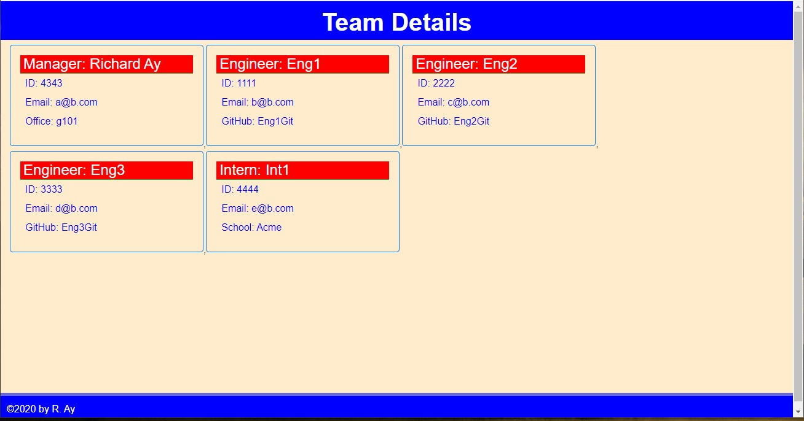

# Employee Summary Project

Richard Ay, (October 2020, *updated February 2022*)

## Table of Contents
* [Project Objective](#project-objective)
* [Acceptance Criteria](#acceptance-criteria)
* [Usage Instructions](#usage-instructions)
* [Deployment Link](#deployment-link)
* [Employee Summary Logic](#employee-summary-logic)
* [Technologies Used](#technologies-used)
* [Application Screen Shot and Video Link](#application-screen-shot-and-video-link)

## Project Objective
As a manager I want to generate a webpage that displays my team's basic information so that I have quick access to their emails and GitHub profiles.

## Acceptance Criteria
GIVEN a command-line application that accepts user input:

1) When I am prompted for my team members and their information THEN an HTML file is generated that displays a nicely formatted team roster based on the user's input.
2) When I click on an email address in the HTML THEN my default email program opens and populates the TO field of the email with the address.
3) When I click on the GitHub username THEN that GitHub profile opens in a new tab.
4) When I start the application THEN I am prompted to enter the team manager’s name, employee ID, email address, and office number.
5) When I enter the team manager’s name, employee ID, email address, and office THEN I am presented with a menu with the option to add an engineer or an intern, or to finish building my summary.
6) When I select the engineer option THEN I am prompted to enter the engineer’s name, ID, email, and GitHub username, and I am taken back to the menu.
7) When I select the intern option THEN I am prompted to enter the intern’s name, ID, email, and school, and I am taken back to the menu.
8) When I decide to finish building my team THEN I exit the application, and the HTML is generated.

## Usage Instructions
This is a command-line application.  Assuming 'nodejs' is installed on the machine, issue the command "node index" from the console command-line.

TDD (Test Driven Development) tests can be run by issuing the command "npm run test", or "npm run test <object>".

## Deployment Link
The deployment link to display the updated web page is: 
[GitHub Pages](https://github.com/CaptainRich/Employee-Summary) 

## Employee Summary Logic

1) The application can be started by typing "node index" into the terminal command line.
2) The top level function prompts for the Manager's information, and stores this data in an array (of objects).
3) Based on the Manager's response for the next action, a recursive routine is invoked to obtain the data for either Engineers or Interns.  The prompts for Managers, Engineers, and Interns are slightly different, but for each, their data is saved to the same array of objects.
4) When the Manager indicates that data entry is complete, an HTML generation routine is invoked to create the HTML page.  This is followed by a routine to actually write the HTML file (index.html) to the '/dist' subdirectory.
5) Staff data is stored in an array of objects, where each object contains the data specific to the type of object (Manager, Engineer, Intern).  When generating the HTML page the array utilities of 'filter' and 'map' are used to properly construct the HTML page.
6) The style sheet for the HTML page is also located in the '/dist' subdirectory (along with the video for submission).

## Technologies Used
* Node.js
* objects
* npm (inquirer, jest)
* Javascript( ..., map, promise)
* HTML
* CSS

## Application Screen Shot and Video Link

Application screen shot:

VIDEO:  The video (mp4) file can be found in '/dist'.  The video is too large to play in Git, and therefore must be downloaded to play.

Video Link: https://github.com/CaptainRich/Employee-Summary/blob/feature/html-map/dist/my_team_with_tests.mp4 

